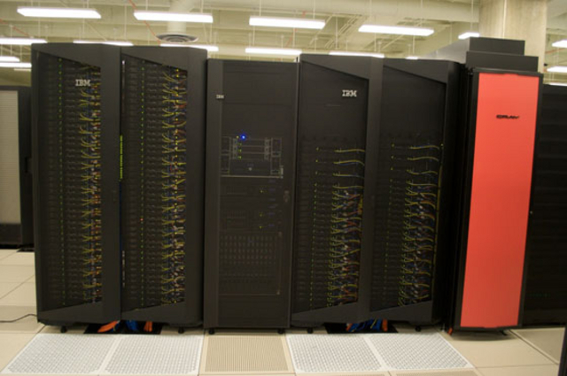
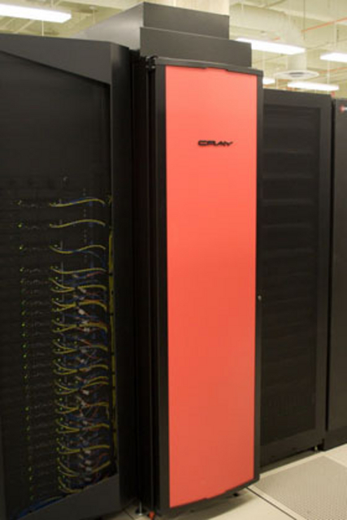
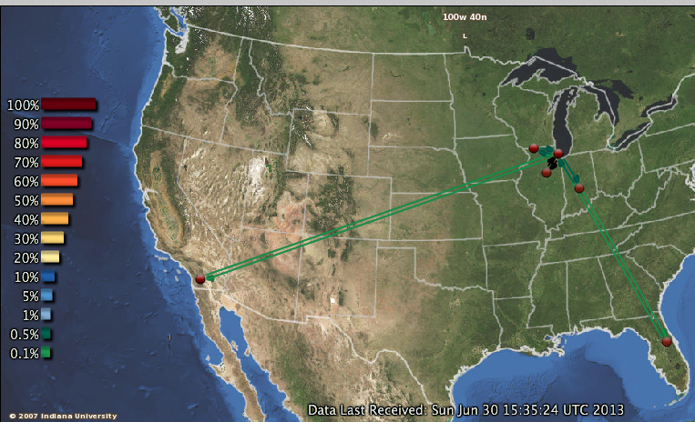

.. _s-hardware:

**********************************************************************
Hardware
**********************************************************************

.. sidebar:: Page Contents

   .. contents::
      :local:

FutureGrid is built out of a number of clusters of different types and
sizes that are interconnected with up to a 10GB Ethernet between its sites.

The sites include Indiana University, University of Chicago, San Diego
Supercomputing Center, Texas Advanced Computing Center, and University
of Florida.

Compute Resources
==================

The tables :ref:`t-clusters` and :ref:`t-clusters-details` show an
overview of some imporatnt information about these clusters.

.. _t-clusters:

.. exceltable:: Overview of the Clusters
   :file: fg-cluster-details.xls
   :header: 1
   :selection: A1:I11
   :sheet: fg-cluster

.. _t-clusters-details:

.. exceltable:: Selected Details of the Clusters
   :file: fg-cluster-details.xls
   :header: 1
   :selection: A1:J28
   :sheet: fg-cluster-details

FutureGrid systems team members are working on enhancements that could lead to increase in the number of cores, memory size, and scratch space.  We will keep you up to date on the developments.

.. csv-table:: Storage Resources
   :header:  System Type   , Capacity (TB)      , File System   , Site    

   DDN 9550          , 339 shared with IU +   , Luster            , IU        
   Data Capacitor    ,  16 TB dedicated       ,                   ,            
   DDN 6620          , 120                    , GPFS              , UC         
   SunFire x4540     , 96                     , ZFS               , SDSC       
   Dell MD3000       , 30                     , NFS               , TACC       
   IBM dx360 M3      , 24                     , NFS               , UF         

Networks
======================================================================

.. csv-table::
   :header: Resource Name, Network Devices
   
   IU Cray, Cray 2D Torus SeaStar 
   IU iDataPlex , DDR IB , QLogic switch with Mellanox ConnectX adapters,Blade Network Technologies & Force10 Ethernet switches
   SDSC, DDR IB, Cisco switch with Mellanox ConnectX adapters, Juniper Ethernet switches
   TACC, QDR IB , Mellanox switches and adapters, Dell Ethernet switches
   UC, DDR IB, QLogic switch with Mellanox ConnectX adapters, Blade Network Technologies & Juniper switches
   UF, Ethernet only (Blade Network Technologies & Force10 switches)

 

The FutureGrid network provides connectivity among FutureGrid
participants, and network access to the Network Impairments Device
(NID).  Five participants connect through a variety of network
providers (see :ref:`f-network-logical`). Interconnects at the Indiana
Gigapop, Internet2 and NLR extend access to FutureGrid resources to
researchers nationally and internationally.

.. _f-network-logical:

.. figure::  images/FutureGrid-Logocal-v3.png
   :height: 300px
   :width: 400px
   :align: left

   Figure: Logical Network Diagram

.. _f-network-juniper:

.. figure:: images/Juniper-EX8208-140x184.png
   :width: 100px
   :height: 100px
   :align: right 

   Figure: Juniper EX8208

 
.. todo::   inaccurate atlas diagram, can not change as network group has no
   info, however wil lead to confusion, needs to be stated

.. todo::  proxy router is mentioned, but we seem only to have
   dosabled commands, which commands can users do?

 
FutureGrid deployed a Juniper EX8208 at the Core in Chicago’s
StarLight facility. The Juniper EX series provides for Layer2 and
Layer3 connectivity.  FutureGrid uses the EX to fulfill the network
services (i.e., interconnectivity and external connectivity). The EX
provides a special feature labeled ‘firewall based forwarding’,
allowing seamless integration with network impairments.
The GlobalNOC at Indiana University provides network engineering
services, and email and phone support. GlobalNOC resources for public
WAN information can be found at `http://noc.futuregrid.org/
<http://noc.futuregrid.org/>`__. Available tools include:

.. list-table::
   :header-rows: 1
   :widths: 20,20,60

   * - Image 
     - Tool
     - Description
   * - |image-gnoc-traffic| 
     - `FutureGrid Atlas <http://noc.futuregrid.org/futuregrid/live-network-status/maps--graphs/futuregrid-atlas.html>`__
     - View the current level of FutureGrid Network traffic as displayed on a
       geographical map.
   * - |image-gnoc-snap| 
     - `SNAPP Traffic Graphs <http://noc.futuregrid.org/futuregrid/live-network-status/traffic-statistics/futuregrid-snapp-trafic-graphs2.html>`__
     - View high-speed traffic graphs collected at one-minute samples using the
       Indiana University-developed SNAPP tool. Create custom views of the
       FutureGrid network and view historic utilization with greater data
       resolution.
   * - |image-gnoc-proxy| 
     - `FutureGrid NOC Router Proxy <http://noc.futuregrid.org/futuregrid/live-network-status/traffic-statistics/router-proxy3.html>`__
     - Submit show commands to the FutureGrid router.
   * - |image8|
     - `FutureGrid Physical Map
       <http://noc.futuregrid.org/futuregrid/maps--documentation/maps.html#FutureGrid%20Physical%20Map>`__
     - TBD
   * - |image9|
     -  `FutureGrid Topology Map <http://noc.futuregrid.org/futuregrid/maps--documentation/maps.html#FutureGrid%20Topology%20Map>`__
     - TBD 

As IPv6 test beds are not available at all FutureGrid partner sites,
early implementation of iPv6 would slow important software development
work. As a result, current plans call for FutureGrid to continue using
IPv4. 
 
Below is further information about networking:

.. list-table::
   :header-rows: 1
   :widths: 20,20,60

   * - Resource
     - Network Switch
     - Link
   * - FutureGrid Core
     - Juniper EX8200
     -
   * - India
     - Force10 C-150
     - `Juniper/Dell EX series Force 10 <https://www.juniper.net/us/en/products-services/switching/ex-series/Force10>`__
   * - Bravo
     - Force10 S60
     - `force10-s60 <http://www.dell.com/us/enterprise/p/force10-s60/pd>`__
   * - Delta
     - Force10 S60
     -
   * - Echo
     - Force10 S60
     -
   * - Sierra
     - Juniper EX4200
     -
   * - Hotel
     - Juniper EX4200
     -
   * - Alamo
     - Dell PowerConnect 6000 Series
     - `Dell, PowerConnect <http://www.dell.com/us/enterprise/p/switch-powerconnect>`__
   * - Alamo
     - Dell PowerConnect 6224
     -
   * - Xray
     - Force10, C-150
     - `Force10-c150 <http://www.dell.com/us/enterprise/p/force10-c150/pd>`__ 
   * - foxtrot
     - internal network switch: IBM/BLADE Rack Switch G8000 and public
       network switch: Force10 S50
     -
   * - Node NICs
     - built-in (IBM iDataPlex DX360 M2) dual Intel 82575EB Gigabit Network Connection
       10Gbps, Myricom Myri-10G Dual-Protocol NIC (available on login
       node)
     -
 
.. todo:: network swithes inside india not corerct

.. todo:: unkown switch, hotel india, foxtrot?
   `IBM rack switches (formerly BNT) <http://www-03.ibm.com/systems/networking/switches/rack.html>`__
 
 
 

Network Impairments Device (NID)
======================================================================

Researchers on FutureGrid may periodically employ the use of a Spirent
XGEM, a Network Impairments Emulator.  The XGEM allows users to
accurately create the delays and impairments that occur over live
production networks for validating and evaluating new products and
technologies.  The XGEM supports a variety of impairments with the most
common being delay, packet loss, jitter and re-ordering.
 

.. figure:: images/Spirent-XGEM.png
   :width: 200px
   :align: right
   
   Figure: Spirent XGEM 
 
The XGEM contains two blades, each with a 10GE interface.  Traffic
received on one blade is automatically transmitted on the other blade,
and vice-versa.  This allows the XGEM to be deployed as a pass-through
device.  Impairments are applied unidirectionally.  An identical or
different impairment can be applied in either direction, or
simultaneously in both directions.
 
FutureGrid also utilizes a Juniper EX8208 as the primary network
element between all of the FutureGrid participants.  Juniper’s EX
platform contains firewall-based forwarding, which allows us to insert
the XGEM between FutureGrid participants with only software changes (see
Figure 1).
 
The firewall-based forwarding feature can be configured to forward
traffic unidirectionally or bidirectionally through the XGEM using a
single IP address or any size subnet.  Only traffic defined by the
Juniper EX8208 will be impaired, leaving all other traffic between
FutureGrid participants unaffected.
 
This implementation requires traffic to traverse the FutureGrid Core
in order to be impaired.  Additional configuration might be required at
the participants' individual sites for impairments to occur locally.
 

.. |image8| image:: images/futuregrid-physical.png
   :width: 100px

.. |image9| image:: images/futuregrid-topology.png
   :width: 100px

.. |image-gnoc-snap| image:: images/gnoc-snap.png
   :width: 100px

.. |image-gnoc-proxy| image:: images/gnoc-proxy.png
   :width: 100px

