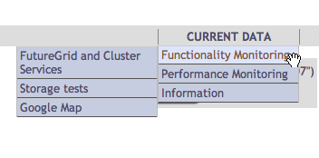
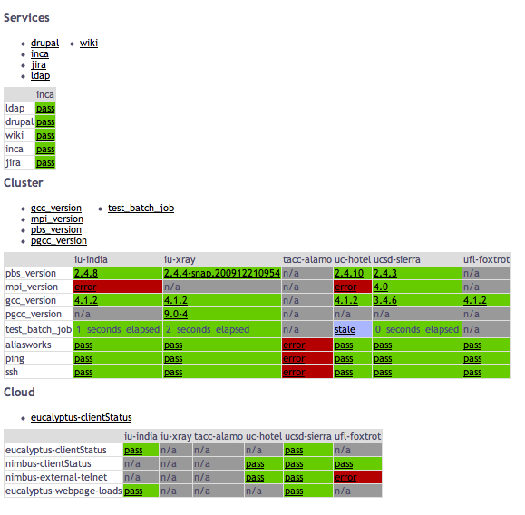
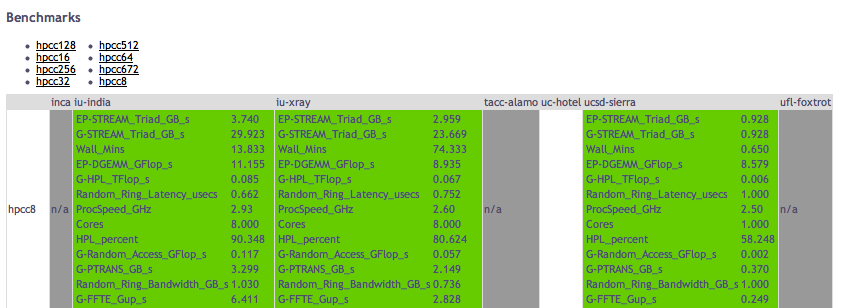

.. _s-inca:

**********************************************************************
Using Inca
**********************************************************************

.. sidebar:: Page Contents

   .. contents::
      :local:

Introduction
============

One of the main goals for FutureGrid is providing quality assurance of
our software components. This document will describe the quality
assurance methods employed by Inca on FutureGrid and will describe how
to contribute additional functionality tests to it.

Another major goal for the FutureGrid performance group is to assess the
performance of the FutureGrid infrastructure. As such, both active and
passive performance measurements will be collected and analyzed. This
document will also describe the active measurement collection method
using by Inca. For passive measurements, please see the `Netlogger How
To
document <https://wiki.futuregrid.org/index.php/Docs/Performance/NetloggerHowTo>`__.

Inca is a tool used for monitoring the user-level functionality and
performance of cyberinfrastructure systems. It automates the
installation, execution and maintenance of a large variety and number of
reporters (monitoring scripts) consistently across resources. Monitoring
results are collected, archived, and then displayed through `web status
pages <http://inca.futuregrid.org/>`__. Currently, there are 196 Inca
reporters available to test and measure aspects of FutureGrid systems.
This document will describe the reporters deployed today on FutureGrid
and how to either deploy an existing reporter to test your FutureGrid
component or write a new Inca reporter using either the Perl or Python
API.

Scope
=====

This document applies to anyone developing or deploying FutureGrid
software components.

Deployment Information
======================

Inca currently runs within a VM, inca.futuregrid.org, running on Quarry.
There are currently three main types of Inca monitoring setup on
FutureGrid currently.  

#. **FutureGrid services tests** - runs simple unit tests of services
   that are global to FutureGrid. Currently, these include tests such
   the Drupal FutureGrid site, the Jira ticketing system, the internal
   Wiki site, and the LDAP server used to store user names and SSH keys.
#. **FutureGrid cluster tests** - runs simple unit tests to test
   connectivity to the FutureGrid cluster machines and the software
   environment. The connectivity tests first test that the alias works
   (aliasworks) and then test that the machine is pingable and that the
   Inca account can SSH there. The software environment tests report
   the version of GCC (gcc\_version), MPI (mpi\_version for iDataplex
   and pgcc for Cray), and PBS. A small unit test tries to submit a
   test job thru the queue using PBS (test\_batch\_job).
#. **FutureGrid performance tests** - runs benchmarks to test the
   performance of the FutureGrid cluster machines. Currently we just
   run HPCC.

Tests results are available
at:\ `inca.futuregrid.org <http://inca.futuregrid.org/>`__

Tests that run local on the machine show up as "n/a" if Inca does not
yet have an account on that machine. The Inca deployment is managed by
Shava Smallen <ssmallen@sdsc.edu\ > who is responsible for deploying new
reporters and reporter instances to FutureGrid.  Access to configuration
changes is limited because Inca employs active monitoring, which
introduces load to the system.  Thus, having a review process is
important to in order the system is not over-monitored (i.e., interferes
with users). 

Using Inca
==========

Decide on Data to Collect
-------------------------

Emulate a User
~~~~~~~~~~~~~~

Many monitoring systems run from the perspective of the system
administrators and do not test beyond whether a port is open or not.  While important, we have found that it is really important to test from
the perspective of the user to ensure the software is properly installed
and is accessible to users. Therefore, Inca runs from a regular user
account and in practice is setup like any other user account.
Oftentimes, commands that are printed in the user guides or manual are
good tests that can be wrapped into an Inca reporter. Even just one or
two simple unit tests can be effective in detecting installation or
permission problems.

Consider Load
~~~~~~~~~~~~~

Ideally, we would like to monitor frequently in order to quickly detect
problems before the users notice them. However, active measurements
introduce load into the system and it is important to not interfere with
users. Therefore consider the measurement you are collecting and select
a measurement frequency that balances freshness of results with impact
on the system; i.e., active measurements that introduce minimal load on
the system can be run at a higher frequency than active measurements
that introduce medium to high load to the system. If applicable, you
may consider decomposing a measurement into multiple parts so that the
lightweight parts that can be run more frequently. For example,
checking that a VM is successfully deployed via RAIN introduces load to
the system and should probably not be executed more than once every few
hours.  However, we could run a test that queries the list of available
VMs every 10 minutes with minimal load to the system.

Test and/or Measure
~~~~~~~~~~~~~~~~~~~

The easiest way to get started with monitoring your component is to
write a simple unit test. This test can be a simple command from the
user documentation that every user is likely to run and you can likely
leverage an existing Inca reporter to test it as discussed below. Once
you gain some familiarity with Inca, you can develop more intricate
tests to verify more functionality of your component or to detect
frequently occurring problems users are reporting. As you develop more
intricate tests, consider the performance of your component and the data
that would be useful to collect in order to detect performance problems
and identify bottlenecks. For example, to measure the performance of
RAIN's invocation mechanism, we would like to know: 1) the time to
transfer a VM to the resource, 2) the time to submit the request to
Eucalyptus/Nimbus/XCAT, 3) the time before the VM is pingable, and 4)
the time before the VM is login-able. Inca provides a flexible data
model so any information you can express in a XML document is supported
and is described further below. Email notifications can be set if
performance drops beyond a threshold and the data can be viewed through
the Inca web pages.

Utilize an Existing Reporter
----------------------------

As mentioned above, there are 196 existing Inca reporters available in
the FutureGrid reporter repository. Click on the link below to view the
list of Inca reporters and click on each name to view the usage data and
see the source code.

http://inca.futuregrid.org/repository

If your software component runs on TeraGrid, it is likely we have an
existing Inca reporter for it. Otherwise, you might check out some of
our generic reporters listed below: 

-  `user.search.output.unit <http://inca.futuregrid.org/repository/cgi-bin/reporters.cgi?action=help&reporter=user.search.output.unit>`__ -
   takes as input a command to execute and a list of regular expressions
   to look for in the output to indicate the command succeeded; e.g.,
   the following executes a ldapsearch command and looks for the string
   "result: 0 Success"

::

    % user.search.output.unit -com="ldapsearch -h im3r.idp.iu.futuregrid.org -x -b'dc=futuregrid,dc=org' '(objectclass=*)'" \
    -delim="|" -help="no" -log="3" -search="result: 0 Success" -verbose="1" -version="no"

-  `grid.wget.unit <http://inca.futuregrid.org/repository/cgi-bin/reporters.cgi?action=help&reporter=grid.wget.unit>`__ -
   takes as input a url and checks to see if the webpage load
   successfully.  E.g., the following checks that the Inca web page
   loads correctly.

::

    % grid.wget.unit -help="no" -log="0" -page="http://inca.futuregrid.org" -verbose="1" -version="no" -wgetArgs=""

The following checks that the Eucalyptus web page on India loads
successfully:

::

    % grid.wget.unit -help="no" -log="3" -page="https://eucalyptus.india.futuregrid.org:8443" -verbose="1" -version="no" -wgetArgs="--no-check-certificate"

-  `network.telnet.unit <http://inca.futuregrid.org/repository/cgi-bin/reporters.cgi?action=help&reporter=network.telnet.unit>`__
   - used to check to see if a port is open from a remote site
-  `network.ping.unit <http://inca.futuregrid.org/repository/cgi-bin/reporters.cgi?action=help&reporter=network.ping.unit>`__
   - checks if a machine is pingable

| 
|  If you would like to deploy an existing Inca reporter for your
component, email Shava Smallen at ssmallen@sdsc.edu with the name of the
reporter, the arguments, frequency of execution, and whether you want
email notification upon failure or file a Jira ticket for Shava.Smallen.

Write Your Own Reporter
-----------------------

If there is no existing reporter for your FutureGrid component, it is
straightforward to write a new one with the Inca Perl and Python APIs. 

Download APIs and Reporters
~~~~~~~~~~~~~~~~~~~~~~~~~~~

To access the APIs, first download the tar.gz file such as

::

    % wget http://inca.sdsc.edu/releases/latest/Inca-Reporter.tar.gz

Then unzip/untar the tar.gz file

::

    % tar zxvf Inca-Reporter.tar.gz 
    % ls Inca-Reporter-*
    COPYRIGHT  ChangeLog  MANIFEST  Makefile  Packages.gz  bin  cgi-bin  docs  etc  lib  sbin  share  version

The reporters are located in the 'bin' directory and the Perl and Python
APIs are in 'lib/perl' and 'lib/python' respectively. Next checkout the
latest reporters developed from svn and put them in a 'bin.svn'
directory

::

    % svn checkout https://futuregrid.svn.sourceforge.net/svnroot/futuregrid/core/trunk/src/performance/benchmarking/framework/inca/bin bin.svn
    A    bin.svn/performance.infiniband
    A    bin.svn/futuregrid.cluster.partition
    A    bin.svn/performance.hpcc
    Checked out revision 487.

How to Execute a Reporter
~~~~~~~~~~~~~~~~~~~~~~~~~

All reporters can be run on the command line and will print XML as shown
below.  Help information for a reporter can be printed by adding
argument '-help' which will by default print the help info in XML. To
print it in text format, also add '-verbose=0' argument. For
information about the report XML schema, please see the `Inca User
Guide <http://inca.sdsc.edu/releases/2.5/guide/userguide-reporters.html>`__.

::

    % env PERL5LIB=lib/perl PYTHONPATH=lib/python ./bin/grid.wget.unit -page="http://inca.sdsc.edu"
    <?xml version='1.0'?>
    <rep:report xmlns:rep='http://inca.sdsc.edu/dataModel/report_2.1'>
      <gmt>2010-10-29T22:53:59Z</gmt>
      <hostname>client64-139.sdsc.edu</hostname>
      <name>grid.wget.unit</name>
      <version>7</version>
      <workingDir>/tmp/Inca-Reporter-5.12450</workingDir>
      <reporterPath>./bin/grid.wget.unit</reporterPath>
      <args>
        <arg>
          <name>help</name>
          <value>no</value>
        </arg>
        <arg>
          <name>log</name>
          <value>0</value>
        </arg>
        <arg>
          <name>page</name>
          <value>http://inca.sdsc.edu</value>
        </arg>
        <arg>
          <name>verbose</name>
          <value>1</value>
        </arg>
        <arg>
          <name>version</name>
          <value>no</value>
        </arg>
        <arg>
          <name>wgetArgs</name>
          <value></value>
        </arg>
      </args>
      <body>
        <unitTest>
          <ID>wget</ID>
        </unitTest>
      </body>
      <exitStatus>
        <completed>true</completed>
      </exitStatus>
    </rep:report>

::

    % env PERL5LIB=lib/perl PYTHONPATH=lib/python ./bin/cluster.uptime.performance 
    <?xml version='1.0'?>
    <rep:report xmlns:rep='http://inca.sdsc.edu/dataModel/report_2.1'>
     <gmt>2010-10-29T22:55:33Z</gmt>
     <hostname>client64-139.sdsc.edu</hostname>
     <name>cluster.uptime.performance</name>
     <version>1</version>
     <workingDir>/private/tmp/Inca-Reporter-5.12450</workingDir>
     <reporterPath>./bin/cluster.uptime.performance</reporterPath>
     <args>
      <arg>
        <name>help</name>
        <value>no</value>
      </arg>
      <arg>
        <name>log</name>
        <value>0</value>
      </arg>
      <arg>
        <name>verbose</name>
        <value>1</value>
      </arg>
      <arg>
        <name>version</name>
        <value>no</value>
      </arg>
     </args>
     <body>
      <performance>
        <ID>load average</ID>
        <benchmark>
          <ID>load average</ID>
          <statistics>
            <statistic>
              <ID>fifteen minute</ID>
              <value>0.30</value>
              <units>fraction</units>
            </statistic>
            <statistic>
              <ID>five minute</ID>
              <value>0.30</value>
              <units>fraction</units>
            </statistic>
            <statistic>
              <ID>one minute</ID>
              <value>0.30</value>
              <units>fraction</units>
            </statistic>
          </statistics>
        </benchmark>
      </performance>
     </body>
     <exitStatus>
      <completed>true</completed>
     </exitStatus>
    </rep:report>

Using an API
~~~~~~~~~~~~

Inca accepts any type of data that can be expressed as an XML document
with a size limit of 12,000 chars. The Inca reporter APIs provide will
help you print out XML and wrap it within the Inca schema. There are
also a number of convenience APIs for writing specific types of
reporters. The advantage of using one of these APIs is that the Web
status pages already know how to display the data (e.g., in graphs).

Links to the API documentation are below:

-  `Perl API <http://inca.sdsc.edu/releases/2.5/repdocs/perl.html>`__
-  `Python
   API <http://inca.sdsc.edu/releases/2.5/repdocs/python.html>`__

Please see the Reporter section of the Inca user guide as well.

-  `Inca User
   Guide <http://inca.sdsc.edu/releases/2.5/guide/userguide-reporters.html>`__

Often the easiest way to get started is to find a reporter similar to
the one you want to write, copy it, and then modify it.  Some common
reporter types are shown below.

Performance Reporter
^^^^^^^^^^^^^^^^^^^^

If you wanted to report some simple performance numbers, you will want
to use the Performance schema in either
`Perl <http://inca.sdsc.edu/releases/2.6/repdocs/Inca/Reporter/Performance.html>`__
or
`Python <http://inca.sdsc.edu/releases/2.6/repdocs/inca.PerformanceReporter.PerformanceReporter-class.html>`__.
You might copy the grid.wget.performance reporter written using the
`Inca::Reporter::Performance <http://inca.sdsc.edu/releases/2.6/repdocs/Inca/Reporter/Performance.html>`__
Perl API and shown below.  Then modify the command and change the
benchmark name and parameters.  You might also consider using the short
form of the XML body output if you are concerned about running into the
12000 char limit.

::

    #!/usr/bin/env perl
    use strict; 
    use warnings; 
    use Inca::Reporter::Performance; 
    # create reporter object and parse args
    my $reporter = new Inca::Reporter::Performance( 
    name => 'grid.wget.performance',
    version => 7,
    description => 'Reports the bandwidth reported by wget',
    url => 'http://inca.ucsd.edu',
    measurement_name => 'wget'
    ); 
    $reporter->addArg('page', 'web page url to download', 'http://cnn.com/index.html'); 
    $reporter->addArg('wgetArgs', 'wget arguments (e.g. --no-check-certificate)', );
    $reporter->processArgv(@ARGV); my $page = $reporter->argValue('page'); 
    my $args = $reporter->argValue('wgetArgs'); 
    # run command and parse data
    my $wgetCmd = "wget $args -O /dev/null $page"; 
    my $output = $reporter->loggedCommand($wgetCmd); 
    if($? || ($output !~ /([\d.]+) \wB\/s/)) { 
    my $err = "wget command failed: $output $!";
    $err =~ s/--\d{2}:\d{2}:\d{2}--/--xx:xx:xx--/g;
    $reporter->setResult(0, $err);
    } else { 
    # format data in XML
    my $benchmark = $reporter->addNewBenchmark('download');
    $benchmark->setParameter('page', $page);
    my ($pre, $unit) = $output =~ /([\d.]+) (.B\/s)/;
    $benchmark->setStatistic('bandwidth', $1, $unit);
    $reporter->setResult(1);
    } 
    $reporter->print(); 

Test Reporter
^^^^^^^^^^^^^

If you need a more elaborate test than what the
`user.search.output.unit <http://inca.futuregrid.org/repository/cgi-bin/reporters.cgi?action=help&reporter=user.search.output.unit>`__
reporter provides, you will want to utilize the SimpleTest schema in
either
`Perl <http://inca.sdsc.edu/releases/2.6/repdocs/Inca/Reporter/SimpleUnit.html>`__
or
`Python <http://inca.sdsc.edu/releases/2.6/repdocs/inca.SimpleUnitReporter.SimpleUnitReporter-class.html>`__.
You might copy over the
reporter \ `data.access.postgres.unit.connect <http://inca.futuregrid.org/repository/cgi-bin/reporters.cgi?action=help&reporter=data.access.postgres.unit.connect>`__,
change the arguments, command, and log messages.  Note, to get the log
messages to print you must run the reporter with '-log=3' or higher.

::

    #!/usr/bin/env perl

    use strict;
    use warnings;
    use Inca::Reporter::SimpleUnit;

    my $BACKOFF_SECS = 30;
    my $reporter = new Inca::Reporter::SimpleUnit(
      name => 'data.access.postgres.unit.connect',
      description => 'Tries to connect to postgres server and list databases',
      version => 8,
      unit_name => 'postgres connect'
    );
    $reporter->addArg('exec', 'postgres user account', 'psql');
    $reporter->addArg('user', 'postgres user account', '');
    $reporter->addArg('numTries', 'number of connect attempts before giving up', 5);
    $reporter->processArgv(@ARGV);
    my $user = $reporter->argValue( 'user' );
    $user = "-U $user" if $user ne '';
    my $psql = $reporter->argValue( 'exec' );
    my $numTries = $reporter->argValue( 'numTries' );

    my $success = 0;
    my @output;
    my $i;
    for( $i = 0; $i < $numTries && ! $success; $i++ ) {
      sleep( $BACKOFF_SECS * $i ) if $? != 0;
      @output = $reporter->loggedCommand("$psql $user -l");
      $success = 1 if $? 

0; } $reporter->failPrintAndExit( "$psql $user -l failed after $i tries: @output $!" ) if $?; if( ! grep(/List of databases/, @output) ) { $reporter->unitFailure( "Failed to list databases: @output" ); } else { shift @output; shift @output; shift @output; # trim off header (3 lines) my @dbnames = map( /^\\s+(\\S+)/, @output ); $reporter->log( 'info', "databases found: " . join(", ", @dbnames) ); $reporter->unitSuccess(); } $reporter->print();
--------------------------------------------------------------------------------------------------------------------------------------------------------------------------------------------------------------------------------------------------------------------------------------------------------------------------------------------------------------------------------------------------------------------------------------------------------------

Version Reporter
^^^^^^^^^^^^^^^^

If you wanted to ensure the version of a software component is
consistent across all machines, you will want to use the Version schema
in either
`Perl <http://inca.sdsc.edu/releases/2.6/repdocs/Inca/Reporter/Version.html>`__
or
`Python <http://inca.sdsc.edu/releases/2.6/repdocs/inca.VersionReporter-module.html>`__.
There are a number of convenience methods for fetching the version such
as setVersionByCompiledProgramOutput, setVersionByExecutable, or
setVersionByFileContents. The below reporter prints out the version of
Perl on a system.

::

    #!/usr/bin/env perl

    use strict;
    use warnings;
    use Inca::Reporter::Version;

    my $reporter = new Inca::Reporter::Version(
      name => 'cluster.lang.perl.version',
      version => 2,
      description => 'Reports the version of perl',
      url => 'http://cpan.org',
      package_name => 'perl'
    );
    $reporter->processArgv(@ARGV);

    $reporter->setVersionByExecutable('perl -v', 'perl, v([\d\w\.\-]+)');
    $reporter->print();

Misc. Reporter
^^^^^^^^^^^^^^

If the data you want to collect from an active measurement does not
match any of the above categories, consider developing your own schema
in either
`Perl <http://inca.sdsc.edu/releases/2.6/repdocs/Inca/Reporter.html>`__
or
`Python <http://inca.sdsc.edu/releases/2.6/repdocs/inca.Reporter-module.html>`__. For an example of a reporter that uses just the base Reporter class,
please see the
`cluster.admin.topcpu <http://inca.futuregrid.org/repository/cgi-bin/reporters.cgi?action=help&reporter=cluster.admin.topcpu>`__
reporter.

::

    #!/usr/bin/env perl

    use strict;
    use warnings;
    use Inca::Reporter;

    my $reporter = new Inca::Reporter(
      name => 'cluster.admin.topcpu',
      version => 3,
      description => 'Reports top non-root CPU % process',
      url => 'http://inca.sdsc.edu'
    );
    $reporter->processArgv(@ARGV);

    my $output = $reporter->loggedCommand('ps waux');
    $reporter->failPrintAndExit("ps waux failed: $output $!") if $?;
    my $highestCpu = 0;
    my $highestLine;
    foreach my $line(split(/\n/, $output)) {
      next if $line =~ /%|^root/; # Skip header and root procs
      my @columns = split(/\s+/, $line);
      my $cpu = $columns[2];
      next if $cpu < $highestCpu;
      $highestCpu = $cpu;
      $highestLine = $line;
    }
    $reporter->failPrintAndExit('No non-root process found')
      if !defined($highestLine);
    my @columns = split(/\s+/, $highestLine);
    $reporter->setBody(
      $reporter->xmlElement('topcpu', 0,
        $reporter->xmlElement('ID', 1, 'topcpu'),
        $reporter->xmlElement('user', 1, $columns[0]),
        $reporter->xmlElement('pid', 1, $columns[1]),
        $reporter->xmlElement('cpu', 1, $columns[2]),
        $reporter->xmlElement('command', 1, $columns[$#columns]),
      )
    );
    $reporter->setResult(1);
    $reporter->print();

Commit New Reporter
~~~~~~~~~~~~~~~~~~~

Once you have written a new reporter as described in the previous
section, commit it the FutureGrid SVN directory at:
https://futuregrid.svn.sourceforge.net/svnroot/futuregrid/core/trunk/src/performance/benchmarking/framework/inca/bin

Then email Shava Smallen <ssmallen@sdsc.edu\ > and specify the name of
the reporter, the resources where you want it deployed, the argument
values, and execution frequency.

If you are making a change to an existing reporter, email
ssmallen@sdsc.edu and specify the name of the reporter.  More automated
methods for doing this will come later.

View Data
---------

Once your reporter is deployed, you can view the results on the Inca
status pages at:
`http://inca.futuregrid.org <http://inca.futuregrid.org/>`__

The first page shows the Google Map view overview. Click on the
"CURRENT DATA" page and depending on the type of reporter you deployed,
your results will be under either the Functionality or Performance menu
as below:

Your result will show either as pass/fail or as a version under either
Services, Cluster or Cloud, version as below:

Or display performance statistics as below:

Click on your test result in the table to show the full details of the
reporter execution and to view the history.  For more information about
the Inca status pages, please see the Data Display section of the Inca
User
Guide: http://inca.sdsc.edu/releases/2.6/guide/userguide-consumer.html

References
==========

`Inca Home Page <http://inca.sdsc.edu/>`__

