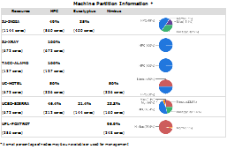
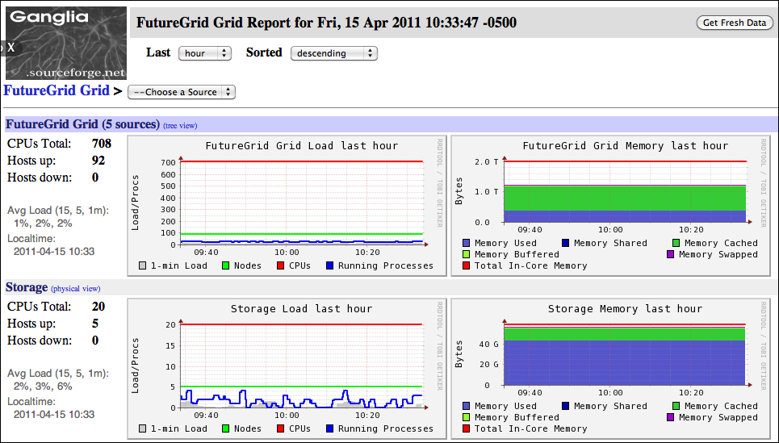
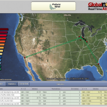
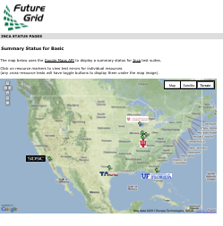
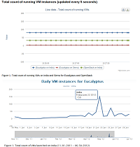
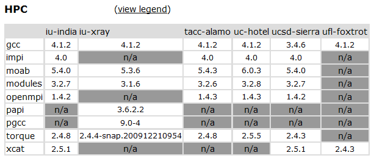
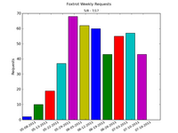

.. _s-status:

**********************************************************************
Status
**********************************************************************

The status of the resources and services can be accessed through:

-  :portal:`https://portal.futuregrid.org/status <status>`

This page also contains a link to our operational status of FutureGrid
resources and services. See the FutureGrid Inca server at:

-  `http://inca.futuregrid.org <http://inca.futuregrid.org/>`__

Scheduled outages and maintenance windows on the FutureGrid network are
collected in the Network Operations Calendar at:

-  `https://noc.futuregrid.org/futuregrid/support/operations-calendar3.html <https://noc.futuregrid.org/futuregrid/support/operations-calendar3.html>`__

The **first Tuesday of each month** is the standard maintenance
window.

You can find a list of outages :portal:`here <outages_all>`
including an :portal:`RSS <feeds/fg_outages_all_rss.xml>` feed.
A subset of the most recent outages are posted on the frontpage. 
  

.. list-table:: System Information
   :header-rows: 1
   :widths: 20,10,70

   * - Image
     - Info
     - Description
   * - |image12| 
     - `System configuration <http://inca.futuregrid.org:8080/inca/jsp/partitionTable.jsp>`__
     - The system is configured at this time using either HPC, Nimbus,
         or Eucalyptus services. The distribution used at this time can be
         found \ `here <http://inca.futuregrid.org:8080/inca/jsp/partitionTable.jsp>`__ and `here <http://inca.futuregrid.org:8080/inca/jsp/status.jsp?suiteNames=Info&xsl=info.xsl>`__.
   * - |image13| 
     - `Status of FutureGrid services <http://inca.futuregrid.org:8080/inca/jsp/status.jsp?queryNames=Health&xsl=table.xsl&resourceIds=FutureGrid>`__
     - Lists the status of key FutureGrid services (e.g., SSH, Nimbus,
       Eucalyptus) in a sortable table.
   * - |image14| 
     - `Ganglia <http://ganglia.futuregrid.org>`__
     - Cluster Monitoring 
   * - |image15|
     - `WAN Network Status <http://noc.futuregrid.org>`__
     - The network status can be viewed via the \ `FutureGrid Network
       Operations Center page <http://noc.futuregrid.org>`__.
       Upcoming network events are maintained on the \ `Network Operations
       Calendar <http://noc.futuregrid.org/futuregrid/support/operations-calendar3.html>`__.
   * - |image16|
     - `Software Status <http://inca.futuregrid.org>`__
     - The operational status of FutureGrid machines are continuously
       monitored via a number of tools. To view some of the contents,
       please visit \ `http://inca.futuregrid.org <http://inca.futuregrid.org>`__
   * - |image17|
     - :portal:`Cloud Status <monitoring/cloud>`
     - Here you will find
       information about how FG cloud services are currently used.
   * - |image18|
     - :portal:`FutureGrid Cloud Metrics <metrics>`
     - Metric system provides an integrated accounting service to view
       cloud usage statistics and graphs regarding the utilization of
       virtual machine (VM) instances. Includes usage stats for
       Eucalyptus, Nimbus, and OpenStack.
   * - |image19|
     - `System software version info <http://inca.futuregrid.org:8080/inca/HTML/rest/HPC/FutureGrid>`__
     - The version info of the installed system software across
       all FG sites
   * - |image20|
     - `Nimbus Usage Reports <http://inca.futuregrid.org/nimbus-stats>`__
     - Displays weekly usage graphs of each of the FutureGrid Nimbus deployments.

.. |image17| image:: images/inca-cloud-monitor.png
   :target: https://portal.futuregrid.org/monitoring/cloud
   :width: 100px
   :height: 100px

