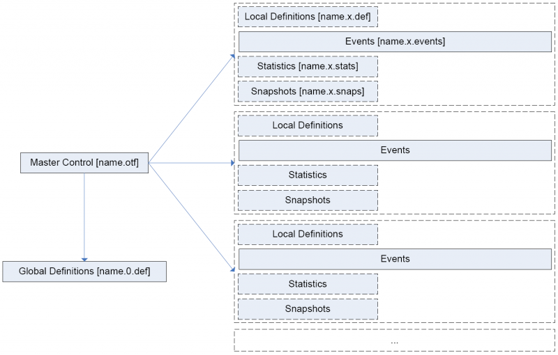

**********************************************************************
Unicore
**********************************************************************

.. sidebar:: Page Contents

   .. contents::
      :local:

   Unicore 6

UNICORE 6 on FutureGrid User Manual
=======================

Author: Karolina Sarnowska-Upton, University of Virginia
Version: 1.0
Last Revision: 2013-07-01, Gregor von Laszewski

Introduction
============

`UNICORE 6 <http://www.unicore.eu/download/unicore6%A0>`__ has been
deployed at various FutureGrid sites. This tutorial explains how to
connect to the existing FutureGrid UNICORE endpoints from other grid
middleware platforms or a UNICORE Commandline Client (UCC). It also explains
how to run jobs on UNICORE sites and how to deploy a new UNICORE grid.

What is UNICORE?
================

UNICORE (Uniform Interface to Computing Resources) is a Grid middleware
system. More information about UNICORE can be found at
`http://www.unicore.eu <http://www.unicore.eu>`__.
Some of the key principles of the UNICORE design are listed below. 

-  Open source under BSD license.

-  Standards conform to the latest standards from the Open
   Grid Forum (OGF), W3C, OASIS, and IETF, in particular the Open Grid
   Services Architecture (OGSA) and the Web Services Resource Framework
   (WS-RF 1.2).

-  Open and extensible realized with a modern Service- Oriented
   Architecture (SOA), which allows easy replacement of particular
   components with others.

-  It is interoperable with other Grid technologies to enable the coupling of
   Grid infrastructures or users needs.

-  Built to be seamless, secure, and intuitive following a vertical, end-to-end
   approach and offers components at all levels of a modern grid
   architecture from intuitive user interfaces down to the resource
   level. Like previous versions UNICORE 6 seamlessly integrates in
   existing environments.

-  Mature security mechanisms that are adequate for use in supercomputing
   environments and Grid infrastructures. X.509 certificates, form the
   basis for authentication and authorization and are enhanced with support
   for proxy certificates and virtual organizations (VO) based access
   control.

-  Workflow support is tightly integrated into the stack while being
   extensible, in order to use different workflow languages and engines
   for domain-specific usage.

-  Application integration mechanisms lie on the client, services and
   resource level to maintain a tight integration of various types of
   applications from the scientific and industrial domain.

-  Different clients serve the needs of various scientific
   communities, e.g. graphical clients to define complex workflows,
   command line tool, web based access.

-  Quick and simple to install and configure, to address requirements
   from operational teams and to lower the barrier of adopting Grid
   technologies. Similarly, the configuration of various services and
   components are easy to handle.

-  Various operating and batch systems are supported on all layers, i.e.
   clients, services and systems; Windows, MacOS, Linux, and Unix
   systems. Also different batch systems are supported such as
   LoadLeveler, Torque, SLURM, LSF, OpenCCS, etc.

-  Implemented in Java to achieve platform independence.

Connecting to the UNICORE BES Endpoints From Other Grid Middleware Clients
==========================================================================

Two UNICORE BES endpoints have been deployed on FutureGrid for
interoperability testing. One endpoint is located on Sierra and the
other is located on India. This section contains the information needed
for other grid middleware platforms to connect to the UNICORE BES
endpoints.

India Endpoint Info <currently unavailable>
-------------------------------------------

Endpoint URL:
   `https://149.165.146.134:8081/DEMO-SITE/services/ <https://149.165.146.134:8081/DEMO-SITE/services/>`__\ BESFactory?res=default\_bes\_factory

Security: configured for username/password authentication;    `Email <mailto:karolina@virginia.edu>`__ for username token and CA cert.

OS: Red Hat Enterprise Linux Server release 5.5

Arch: x86\_64

Cores: 8 (Jobs submitted directly to machine - i.e. not through
   PBS queue)

Sierra Endpoint Info
--------------------

Endpoint URL: 
   `https://198.202.120.85:8081/DEMO-SITE/services/ <https://198.202.120.85:8081/DEMO-SITE/services/>`__\ BESFactory?res=default\_bes\_factory

Security: configured for X-509 based mutual client authentication; `Email <mailto:karolina@virginia.edu>`__ with X-509 cert and for CA cert.

OS: Red Hat Enterprise Linux Server release 5.5

Arch: x86\_64

Cores: 320 (Jobs submitted to 
   PBS queue)

Connecting to the UNICORE BES Endpoints Using a UNICORE Commandline Client
==========================================================================

A UNICORE client can be used to connect to the FutureGrid UNICORE 6
endpoints. This section describes how to install a UCC (UNICORE
Commandline Client), configure it to connect to a FutureGrid U6 endpoint
via X-509 based mutual client authentication and then submit jobs via
BES.

Installing the UNICORE 6 Commandline Client (UCC)
------------------------------------------------

Acquire Client Bundle
~~~~~~~~~~~~~~~~~~~~~

#. Navigate to the UNICORE website:
   `http://www.unicore.eu/ <http://www.unicore.eu/>`__.
#. Select the “Download” link on the tool bar to the left.
#. Under the “Clients” section, select the “Download” link for “Commandline Client”.
#. Click on the folder for desired version  (i.e. 6.4.1)
#. Click on the desired distribution bundle to download  (i.e.
   ucc-6.4.1-all.tar.gz)

Unpack UCC
~~~~~~~~~~

-  Unpack files from the distribution bundle downloaded (i.e. tar -xvzf
   ucc-6.4.1-all.tar.gz)
-  On completion, there should be a directory containing the UNICORE 6
   commandline client  (i.e. ucc-6.4.1)
-  You can add the bin directory to your path for easier client
   execution::

     export PATH=$PATH:<UCC_HOME>/bin,  where UCC_HOME is the directory you installed UCC

Examine UCC Files
~~~~~~~~~~~~~~~~~

Directory Structure

-  bin – contains executable “ucc”
-  certs
-  conf – contains *preferences* file to be configured with security
   and registry settings
-  doc
-  extras
-  lib
-  samples

Run Commandline Client
~~~~~~~~~~~~~~~

Run ucc to get list and description of available commands::

    $UCC_HOME/bin/
    ucc

::

    Usage: ucc <command> [OPTIONS] <args>
     The following commands are available:

     DATA MANAGEMENT
      ls                     - list a storage
      rm                    - remove a remote file or directory
      copy-file-status      - check status of a copy-file
      get-file              - get remote files
      find                 - find files on storages
      resolve                - resolve remote location
      mkdir                  - create a directory remotely
      copy-file             - copy remote files
      put-file               - puts a local file to a remote server

     GENERAL
      create-storage       - create a storage service instance
      connect               - connect to UNICORE
      list-storages         - list the available remote storages
      list-applications    - lists applications on target systems
      list-jobs             - list your jobs
      list-sites             - list remote sites
      system-info            - checks the availability of services

     JOB EXECUTION
      run                    - run a job through UNICORE 6
      get-status             - get job status
      abort-job             - abort a job
      batch                  - run ucc on a set of files
      get-output            - get output files

     OGSA-BES
      bes-list-att           - provides information about U6 BES Interface
      bes-terminate-job      - terminate bes activity
      bes-submit-job         - run a job through UNICORE 6 BES Interface
      bes-list-jobs         - list jobs running on BES.
      bes-job-status         - get bes activity status

     OTHER
      shell                  - starts an interactive UCC session
      issue-delegation      - allows to issue a trust delegation assertion
      connect-to-testgrid   - get credentials for the public testgrid
      wsrf                   - perform a WSRF operation
      cip-query              - query a CIS InfoProvider at a UNICORE site
      run-groovy            - run a Groovy script

     WORKFLOW
      workflow-trace        - trace info on a workflow in Chemomentum
      workflow-control      - offers workflow control functions
      workflow-submit       - submit a workflow
      workflow-info         - lists info on workflows.
      broker-run             - submit work assignment to service

    orchestrator
     Enter 'ucc <command> -h' for help on a particular

Installation Conclusion
~~~~~~~~~~~~~~~~~~~~~~~

At this point, the UNICORE Commandline Client has been
installed. However, the client is currently not connected to any
UNICORE sites. The next section will explain how to configure the
client so that the client will connect to one of the FutureGrid U6
endpoints

Configuring Client to Connect to FutureGrid U6 Endpoints
--------------------------------------------------------

Configuration Overview
~~~~~~~~~~~~~~~~~~~~~~

To connect to a FutureGrid U6 endpoint, you need to

-  Setup security information so that your client will trust the
   FutureGrid U6 endpoint and vice-versa.
-  Specify the connection address that the client should use (aka
   registry address).

This configuration process consists of

-  Setting up the keystore and truststore files with security information.
-  Specifying a registry address for the FutureGrid endpoint.

This information is stored in a *preferences* file (starter at $UCC\_HOME/conf/preferences)

Setting Up Security in UNICORE
------------------------------

To setup security, you will need to inform the UNICORE software of your
identity and who you trust via keystore and truststore files:

Keystore: A file from which UNICORE software reads your identity (i.e. your private key and your certificate).
   As your private key is very sensitive, the keystore is encrypted and you will need a
   password to "unlock” it before usage.
Truststore: A file from which UNICORE software reads certificates of the Certificate Authorities you trust.
   It is not as sensitive as a keystore, but it is also encrypted.

For an overview of the security mechanism found in the UNICORE grid
middleware, please consult the `Users' UNICORE Security Guide \UCC
version <http://unicore.svn.sourceforge.net/svnroot/unicore/documentation/old/securityGuide/Main-UCCOnly.pdf>`__
This guide also discusses common security configuration problems and
details on how to create keystores/truststores

Setting Up a Keystore
------------

Assumption: You want to use a pre-existing X.509 certificate for security
validation.

-  If your key and certificate are in a keystore (in PKCS12 or JKS
   format), you can directly use this keystore.
-  If you have PEM files, you will need to wrap your key and certificate
   files into a PKCS12 keystore.::

    openssl pkcs12 -export -in myCert.pem -inkey myKey.pem -out keystore.p12 -name mykey 

Creating a Truststore
~~~~~~~~~~~~~~~~~~~~~

Assumption: You have certificates for CAs that you trust and want to put
into a truststore file. This should include:

CA cert for CA that issued your certificate.

CA cert for CA that issued FutureGrid U6 endpoint certs (Email
`uvacse@virginia.edu <mailto:uvacse@virginia.edu>`__ for cert).
  

To create a truststore with keytool::

    keytool -import -keystore truststore.jks -file CAcert.pem -alias 
    myTrustedCA

Repeat command for every CA certificate file (set a unique alias for
each certificate).

Acquiring the Registry Address
~~~~~~~~~~~~~~~~~~~~~~

The UNICORE Registry server provides information about available
services to clients and other services.

The registry address for FutureGrid U6 Endpoint on Sierra (as of 08/2011) is::

    https://198.202.120.85:8081/DEMO-SITE/services/Registry?res=default_registry

Connecting to Endpoints w/o Registries
~~~~~~~~~~~~~~~~~~~~~~~~~~~~~~~~~~~~~~

A Registry URL is expected to be provided in the preferences file. If a
BES endpoint is not advertised via a UNICORE Registry, the configuration
options can be modified to allow this behavior.

#. In the preferences file, set the contact-registry to false::

      contact-registry=false

2. Instead, provide at least one BESFactory URL using the following
   format::

      bes.1=https://site1.com/services/BESFactory
      bes.4=file:///tmp/bes.xml
      bes.5=/tmp/bes.xml

If the "contact-registry" option is set to false and no OGSA-BES URL is
specified, UCC will report an error.

To use an XML endpoint reference (EPR) read from a file for contacting a
BESFactory service, the contents of a EPR file must validate against the
WS-Addressing’s endpoint reference schema.

Preferences File Modifications
~~~~~~~~~~~~~~~~~~~~~~~~~~~~~~

Once you have keystore and truststore files, configure the client
preferences file to use this security information

$UCC\_HOME/conf/preferences

-   Keystore Settings

    -  Set keystore path to the full path to where your keystore file is
       saved locally
    -  Provide the password that “unlocks” your keystore file
    -  If you do not want specify the password, you will be asked for it on
       the commandline
    -  Provide keystore’s alias
    -  Provide keystore’s storetype (PKCS12 or JKS)

-   Truststore Settings

    -  Set truststore path to the full path to where your truststore file is
       saved locally
    -  Provide the password that “unlocks” your truststore file

-   Registry Address or BESFactory URL Information

    -  Provide registry address/BESFactory URL of FutureGrid U6 endpoint

Example Preferences File
~~~~~~~~~~~~~~~~~~~~~~~~

::

    keystore=/home/gridcerts/keystore.p12
    password=YOUR-KEYSTORE-PASSWORD
    storetype=pkcs12
    alias=myKeystore

    truststore=/home/gridcerts/truststore.jks
    truststorePassword=YOUR-TRUSTSTORE-PASSWORD

    # The address(es) of the registries to contact (space separated list)
    registry=https://198.202.120.85:8081/DEMO-SITE/services/Registry?res=default_registry

    # ... other properties can follow

Locating the Preferences File
~~~~~~~~~~~~~~~~~~~~~~~~

By default, UCC checks for the existence of a file at
$USER\_HOME/.ucc/preferences and reads default settings from there

Copy your preferences file to this location or specify it’s a location
every time you issue a UCC command::

      -c $UCC_HOME/conf/preferences

Validate Client Setup
~~~~~~~~~~~~~~~

To check access to FutureGrid endpoints, try a command while specifying
the path to your preferences file::

    $UCC_HOME/bin/ucc system-info -v -l -c $UCC_HOME/conf/preferences
    $UCC-HOME/bin/ucc list-sites -c $UCC_HOME/conf/preferences

If everything is alright you should see information about the FutureGrid
endpoint.

Configuration Conclusion
~~~~~~~~~~

Your UCC has now been configured to access the FutureGrid U6 endpoint
via X-509 based mutual client authentication. Consult the next section
to learn about getting started and submit jobs.

Submitting Jobs to FutureGrid U6 Endpoints
------------------------------------------

Getting Started
~~~~~~~~~~~~~~~~

Make sure you have access to some target system::

    $UCC_HOME/bin/ucc connect -c $UCC_HOME/conf/preferences

List the sites available to you using::

      $UCC_HOME/bin/ucc list-sites -c $UCC_HOME/conf/preferences

Run a sample job::

      $UCC_HOME/bin/ucc run -v $UCC_HOME/samples/date.u -c $UCC_HOME/conf/preferences

Submit Jobs to BES
~~~~~~~~~~~~~~

To send a job read from a JSDL file

-  to a site listed in the preferences file::

            $UCC_HOME/bin/ucc bes-submit-job -j hellompi.xml -s bes.3 -v

-  using a BESFactory URL::

      ucc bes-submit-job -j hellompi.xml -s https://example.com/services/BESFactory -v

-  using an endpoint reference file path::

      ucc bes-submit-job -j hellompi.xml -s file:///tmp/bes.xml -v

Other BES Related Commands
~~~~~~~~~~~~~~~~~~~~~~~~~~~~~~~~~~~~~~~~~~~~~~~~~~~~~~~~~~~~~~~~~~~~~~

Check job status::

      ucc bes-job-status jobid.job

Terminate job::

    ucc bes-terminate-job jobid.job

List user’s jobs on a BESFactory::

    ucc bes-list-job-s bes.1

List BESFactory properties::

    ucc bes-list-att -s bes.1

\*Descriptor (.job) file is automatically generated after a successful
execution of "bes-submit-job" command

Job Submission Conclusion
~~~~~~~~~~~~~~~~~~~~~~~~~

You should now be able to submit jobs to a BES service on a FutureGrid
U6 endpoint

References
----------

The information provided in this section has been extracted from the
following sources. Each contains much more detail about the various
topics discussed here.

-  `UNICORE6
   Manuals <https://unicore.svn.sourceforge.net/svnroot/unicore/documentation/old/securityGuide/Main-UCCOnly.pdf>`__
-  `UNICORE Commandline Client: User
   Manual <http://www.unicore.eu/documentation/manuals/unicore6/files/ucc/ucc-manual.html>`__
-  `UNICORE Security Guide:
   UCC <https://unicore.svn.sourceforge.net/svnroot/unicore/documentation/old/securityGuide/Main-UCCOnly.pdf>`__

Questions/Comments
--------------------

Please email uvacse@virginia.edu

Running Jobs on UNICORE Sites
=============================

This section provides a general overview of running jobs on UNICORE
sites.

First, you can check whether there is an available target system for
execution::

     $ucc connect -c <path_to_ucc.preferences> 

You can also list the available target sites::

     $ucc list-sites

To run a job, you can specify the job using the UNICORE `job description
format <http://www.unicore.eu/documentation/manuals/unicore6/ucc/jobdescription.html>`__::

     $ucc run <job_description_file>

Or you can specify a job to run using a Job Submission Description
Language (JSDL) file::

     $ucc run -j <JSDL_file>

For example, a simple job to run the date, date.u, could be described
using the UNICORE description format as follows::

    #
    # simple job: run Date
    #

    {
     ApplicationName: Date,
     ApplicationVersion: 1.0,
    }

This job can then be run with the command::

    $ucc run date.u

Alternately, this job could be described using a JSDL file, date.jsdl,
as follows::

     <?xml version="1.0" encoding="UTF-8"?>
    <jsdl:JobDefinition xmlns="http://www.example.org/"
           xmlns:jsdl="http://schemas.ggf.org/jsdl/2005/11/jsdl"
           xmlns:jsdl-posix="http://schemas.ggf.org/jsdl/2005/11/jsdl-posix"
           xmlns:xsi="http://www.w3.org/2001/XMLSchema-instance">

           <jsdl:JobDescription>
                   <jsdl:JobIdentification>
                           <jsdl:JobName>Test Job</jsdl:JobName>
                   </jsdl:JobIdentification>

                   <jsdl:Application>
                           <jsdl:ApplicationName>Date 1.0</jsdl:ApplicationName>
                           <jsdl-posix:POSIXApplication>
                                 <jsdl-posix:Executable>
                                         /bin/date
                                 </jsdl-posix:Executable>
                         </jsdl-posix:POSIXApplication>
                 </jsdl:Application>
           </jsdl:JobDescription> 
    </jsdl:JobDefinition>

This JSDL job can then be run with the command::

     $ucc run -j date.jsdl.

--------------

Deploying a New UNICORE 6 Grid
==============================

This section details how to install and setup a UNICORE 6 grid. This
will create a new grid infrastructure separate from the existing
deployments mentioned above.

Prerequisites
-------------

Prerequisites listed in UNICORE 6 README.txt file:

-  Java 5 JRE or SDK (or later). We recommend using SUN Java 6.

You can check what version of java is installed by running::

     $java -version

If the java version is too old or the command is not found, download the
latest JRE version. After unpacking, update JAVA\_HOME and PATH::

    JAVA_HOME=<JAVA_LOCATION>
    PATH=<JAVA_LOCATION>/bin:$PATH

-  Perl 5 (only for the classic TSI)

You will need Perl if you will be running jobs via a queue management
system. By default, jobs run directly on the local machine. Extra
configuration is needed to setup a TSI and run jobs via a queue
management system.

Installing the Core Server Bundle
---------------------------------

The UNICORE 6 Core Server Bundle can be downloaded from the `UNICORE
website <http://www.unicore.eu/download/unicore6/>`__. This bundle will
provide you with the minimal set of UNICORE components (Gateway,
UNICORE/X, TSI, XUUDB) needed to get a UNICORE 6 grid up and running
quickly.

From the README.txt::

    The basic configuration and installation is as follows
    1) edit configure.properties
    2) ./configure.py <unicore_user> [<hostname>]
    3) run ./install.py to install UNICORE in the selected directory

    To start the configuration process, do (as non-root user)
    ./configure.py <login> [<hostname>]
    where <login> is the Unix account that the installation shall use, and the   
    optional <hostname> indicates which hostname shall be used. If not given,
    a hostname lookup will be performed.

    If you want to customize this process, edit the "configure.properties" file,
    which contains all the ports and other settings (except security settings 
    such as keystore locations).

    To finally copy the files into the installation directory, run
    ./install.py

    More documentation at http://www.unicore.eu/documentation.
     

Starting/Stopping the UNICORE Servers
-------------------------------------

The servers are started with the start.sh script and stopped with the
stop.sh script. Both of these scripts are located under the UNICORE
install directory::

    You can confirm that the UNICORE servers are running with the ps command. 
    You should see three processes running: XUUDB, Gateway, and UNICOREX.

    $ps aux| grep unicore

