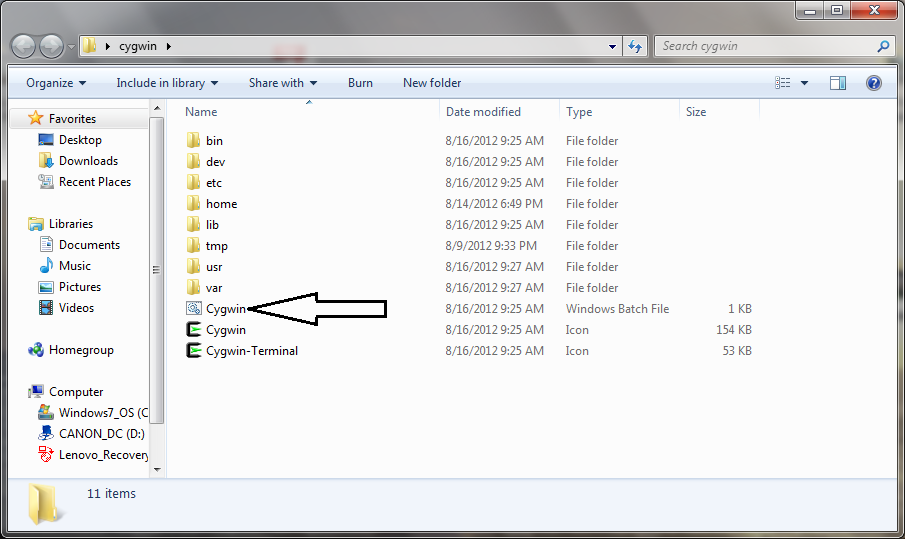
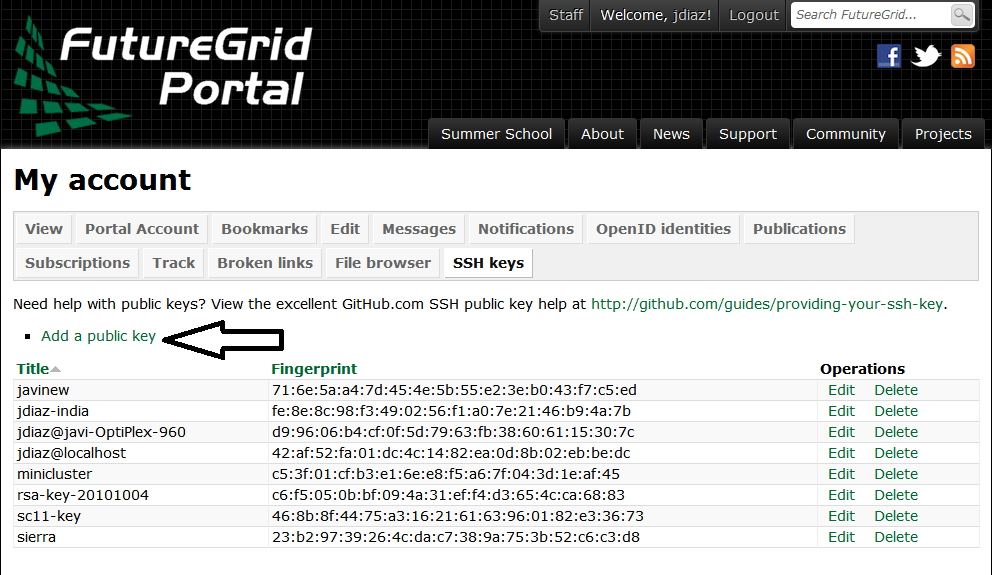

.. _s-ssh-wrong:

**********************************************************************
SSH the wrong way ( DO NOT USE THIS TUTORIAL)
**********************************************************************

.. sidebar:: Page Contents

   .. contents::
      :local:

To properly view this manual page, please log into the FutureGrid
portal with your FutureGrid name.

To access the various FutureGrid resources, you need to provide a
public ssh key to FutureGrid. In this manual, we explain how to
generate a ssh key, upload it to the FutureGrid portal and log onto
the resources. This manual covers both UNIX and Windows Users.

Requirement for Windows Users
=============================

Windows users need to have some special software to be able to use the
SSH commands. We recommend you use Cygwin (Linux-like environment for
Windows) because it will ease your experience with FutureGrid. We have
prepared a Cygwin version that is ready to use (If for some reason you
decide to download and install Cygwin from the official site, remember
that you need to install the ssh packages).

#. Download Cygwin from our
   Portal `https://portal.futuregrid.org/sites/default/files/cygwin.zip <https://portal.futuregrid.org/sites/default/files/cygwin.zip>`__.
#. Uncompress the file.
#. Execute the file the 'Windows Batch File' called Cygwin.bat

   |image1|

#. You may get a warning. Click in the Run button

   |image2|

#. You get a Linux-like terminal that will allow you to continue with
   this manual.

   |image3|

**NOTE**: When showing examples of commands, the $ symbol precedes the
actual command. So, the other lines are the output obtained after
executing the command.

Instructions for both Windows and Unix users
============================================

Generate SSH key
----------------

Use the tool ssh-keygen. This program is commonly available on most
UNIX systems (this includes Cygwin). It will ask you for the location
and name of the new key. It will also ask you for a passphrase, we
**STRONGLY RECOMMEND** that you use a passphrase. We have seem advise
by teachers and teachin assistants to not use passphrases: this is
**WRONG**. If you are not using a pasphrase and someone were to steal
your private key they have easily access to your account. We recommend
using the default location ~/.ssh/ and the default name id\_rsa. A
sample session::

    $ ssh-keygen

    Generating public/private rsa key pair.
    Enter file in which to save the key (/home/Javi/.ssh/id_rsa): 
    Enter passphrase (empty for no passphrase):
    Enter same passphrase again:
    Your identification has been saved in /home/Javi/.ssh/id_rsa
    Your public key has been saved in /home/Javi/.ssh/id_rsa.pub.
    The key fingerprint is:
    90:46:9b:cf:09:16:94:17:df:43:f4:99:97:0d:42:4a Javi@Javi-PC
    The key's randomart image is:

    +--[ RSA 2048]----+
    |.+...Eo= .       |
    |..=.o + o +o     |
    |O.  o o +.o      |
    |o = .   . .      |
    |S                |
    |                 |
    |                 |
    |                 |
    |                 |
    +-----------------+

This command requires the interaction of the user.

1. The first question is::

      Enter file in which to save the key (/home/Javi/.ssh/id_rsa): 

   We recommend you use the default. To do so, just press the enter
   key. In case you already have a ssh key in your machine, you can
   skip this whole section or use a different file name.

2. The second and third question is to protect your ssh key with a
   passphrase. This password will protect your key because you need to
   type it when you want to use it. Thus, you can either type a
   passphrase or press enter to leave it without passphrase. To avoid
   security problems, we DO recommend that chose a passphrase as
   discussed previously. Make sure to not just type return for an
   empty passphrase.::

     Enter passphrase (empty for no passphrase):

   and::

     Enter same passphrase again:

Check your ssh key
------------------

Once, you have generated your key, you should have them in the .ssh
directory::

    $ ls -l ~/.ssh

Copy the content of your public key
-----------------------------------

You need to copy the content of your public key to upload it to the
portal. A sample asumming that you used the default options during the
key generation::

    $ cat ~/.ssh/id_rsa.pub

    ssh-rsa AAAAB3NzaC1yc2EAAAADAQABAAABAQCXJH2iG2FMHqC6T/U7uB8kt6KlRh4kUOjgw9sc4Uu+Uwe/EwD0wk6CBQMB+HKb9upvCRW/851UyRUagtlQexCRM2rMCi0VvhTVZhj61pTdhyl1t8hlkoL19JVnVBPP5kIN3wVyNAJjYBrAUNW4dXKXtmfkXp98T3OW4mxAtTH434MaT+QcPTcxims/hwsUeDAVKZY7UgZhEbiExxkejtnRBHTipi0W03W05TOUGRW7EuKf/4ftNVPilCO4DpfY44NFG1xPwHeimUk+t9h48pBQj16FrUCp0rS02Pj+4/9dNeS1kmNJu5ZYS8HVRhvuoTXuAY/UVcynEPUegkp+qYnR Javi@Javi-PC

Go ahead and select the ouptut, right click, and copy::

    $ cat ~/.ssh/id_rsa.pub

    ssh-rsa AAAAB3NzaC1yc2EAAAADAQABAAABAQCXJH2iG2FMHqC6T/U7uB8kt6KlRh4kUOjgw9sc4Uu+Uwe/EwD0wk6CBQMB+HKb9upvCRW/851UyRUagtlQexCRM2rMCi0VvhTVZhj61pTdhyl1t8hlkoL19JVnVBPP5kIN3wVyNAJjYBrAUNW4dXKXtmfkXp98T3OW4mxAtTH434MaT+QcPTcxims/hwsUeDAVKZY7UgZhEbiExxkejtnRBHTipi0W03W05TOUGRW7EuKf/4ftNVPilCO4DpfY44NFG1xPwHeimUk+t9h48pBQj16FrUCp0rS02Pj+4/9dNeS1kmNJu5ZYS8HVRhvuoTXuAY/UVcynEPUegkp+qYnR Javi@Javi-PC

Upload the key to the FutureGrid Portal
---------------------------------------

Click on the button bellow to add your SSH key (Note: The quick link
button below only works if you are logged in before visiting this page.
Otherwise please make sure you login first and REFRESH this page.)
|image4|

#. If you were logged into the Portal, this button redirects you to a
   page that includes a link Add a public key.
#. Otherwise, this button redirects you to the login page.

   #. Log into the portal

      |image5|

   #. Click in the "ssh key" button

      |image6|

#. Click in the "add a public key" link.

   |image7|

#. Paste your ssh key into the box marked Key.

   |image8|

#. Click the submit button.

-  **IMPORTANT**:

   -  Leave the Title field blank.
   -  Make sure that when you paste your key, it does not contain
      newlines or carriage returns that may have been introduced by
      incorrect pasting and copying. If so, please remove them.

At this point you are all set. However you will still need to wait
till all accounts have been set up to use the resources. Please, check
your email for further updates. You can also refresh this page and see
if the boxes in your account status information are all green. Than
you can continue.

Testing your ssh key
--------------------

Test you key by logging onto India. India cluster gets the new ssh key
updated almost immediately. For other clusters like Hotel, it can take
around 10 minutes to update the ssh keys. If you are viewing this page
anonymously, please replace <USER> with your FutureGrid user name (the
one used to log into the Portal).

If you placed the ssh key in the default location::

    $ ssh -A @india.futuregrid.org

If you used a different path or name for your key::

    $ ssh -A -i <path to private key> @india.futuregrid.org 

The first time you ssh into a machine you will see a message like the
one shown in the picture. You have to type yes and press enter::

**Note**: the presence of the -A argument above is required for Nimbus
tutorials.

**Note 1**: If you are asked for a password when trying to ssh onto
Hotel, do **NOT** type any password. This means that your ssh key is not
updated yet. You need to wait a bit more.

Testing your ssh key on Hotel
-----------------------------

After uploading your ssh key, it can take around 10 minutes to update
the ssh keys of Hotel. So, if you were able to log onto India, you
have set up properly your ssh key. So, after a while you will be able
to log onto Hotel. If you are viewing this page anonymously, Please
replace `<USER>` with your FutureGrid user name (the one used to log
into the Portal).

If you placed the ssh key in the default location::

    $ ssh -A @hotel.futuregrid.org

If you used a different path or name for your key::

    $ ssh -A -i <path to private key> @hotel.futuregrid.org 

The first time you ssh into a machine you will see a message like this::

    The authenticity of host 'hotel.futuregrid.org (149.165.148.5)' can't be established.
    RSA key fingerprint is f8:96:15:b7:21:eb:64:92:6c:de:e0:79:f3:fb:86:dd.
    Are you sure you want to continue connecting (yes/no)? yes 

**Note**: the presence of the -A argument above is required for Nimbus
tutorials.

**Note 1**: If you are asked for a password when trying to ssh onto
Hotel, do **NOT** type any password. This means that your ssh key is
not updated yet. You need to wait a bit more.

.. |image10| Futuregrid is a resource provider for `XSEDE <https://www.xsede.org/>`__.

.. |Home| image:: /sites/all/themes/fgtheme/logo.png
   :target: /

.. |image2| image:: images/cygwin2.png
.. |image3| image:: images/cygwinfirst.png
.. |image4| image:: /sites/default/files/u23/register-sshkey.png
   :target: https://portal.futuregrid.org/user/login

.. |image5| image:: images/portalLogin_0.png
.. |image6| image:: images/portalsshkey.png

.. |image8| image:: images/portalkeypaste_0.png
.. |image9| image:: /sites/default/files/images/nsf-logo.png
   :target: http://www.tacc.utexas.edu/
.. |image10| image:: /sites/default/files/u876/xsede-logo.png
